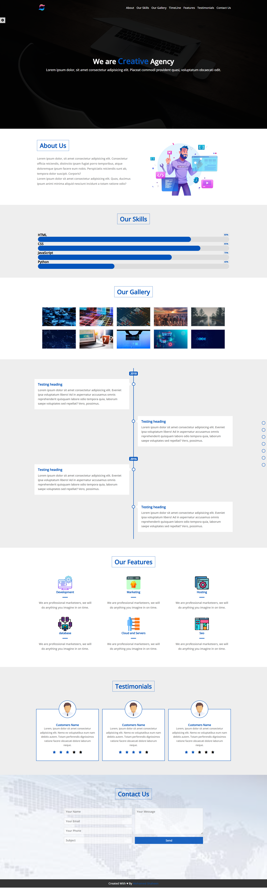

# Creative Agency

A modern and visually appealing website designed to showcase services, projects, and creativity for agencies or businesses.

## Features

- **Responsive Design**: Fully optimized for various devices and screen sizes.
- **Professional Layout**: Clean and engaging design to highlight services and projects.
- **Interactive Elements**: Includes animations and dynamic components for a better user experience.
- **Portfolio Section**: Displays past projects effectively.

## Technologies Used

- **HTML**: Structure of the webpage.
- **CSS**: Styling and layout.
- **JavaScript**: Adds interactivity and smooth transitions.
- **Font Awesome**: Used for professional-grade icons.

## Screenshots

```markdown

```
